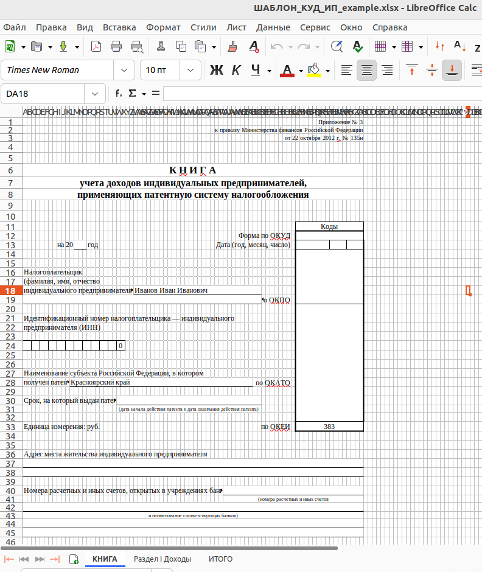

# income_book
## Описание программы 
Моя первая программа, которую я создал для облегчения формирования Книги учета доходов индивидуальных предпринимателей 
(КУД ИП). Согласно Приказу Минфина РФ от 22 октября 2012г. N135н ИП, применяющие патентную систему, 
ведут КУД ИП, в которой в хронологической последовательности на основе первичных документов отражают все хозяйственные 
операции, связанные с получением доходов от реализации. В качестве первичных документов используются кассовые чеки 
от продаж клиентам. Данные об оформленных чеках за период можно получить от Оператора фискальных данных (ОФД) - 
организации, которая передает фискальные данные кассы в налоговую (ФНС). 
## Описание программы
Программа написана на языке python3.11 с использованием библиотек openpyxl и tkinter
## Порядок использования программы
1. Клонируем репозиторий INCOME_BOOK на локальный компьютер, настраиваем виртуальную среду Python3.11 и устанавливаем 
библиотеки с помощью requirements.txt
2. Вначале открываем файл ШАБЛОН_КУД_ИП_example.xlsx и заполняем 1 лист с реквизитами индивидуального предпринимателя
в редакторе для работы с xlsx файлами, где заполняем соответствующие реквизиты ИП: 
Файл следует сохранить под другим именем, например ШАБЛОН_КУД_ИП_фамилияИП.xlsx, в папке PATTERN
3. Получаем отчет от ОФД с данными о кассовых операциях ИП за период в виде xlsx файла и сохраняем его в папке DOWNLOADS
Скриншот части реального отчета о кассовых операциях ИП, полученный от ОФД ЯРУС, из которого программа 
выбирает требуемые данные о полученном доходе: 
4. Убедившись, что находимся в директории проекта запускаем виртуальное окружение командой 
source venv/bin/activate
5. Находясь в папке репозитория командой python3 main.py запускаем программу
6. В открывшемся меню предлагается:
- ввести год за который оформляется КУД
- выбрать исходный xlsx файл в котором оформляется КУД (файл, который мы заполнили и сохранили в папке PATTERN)
- выбрать xlsx файл для загрузки данных ОФД 
Скриншот меню: 

7. После нажатия кнопки 'Сформировать КУД с текущими параметрами' обновится поле меню
'Расположение итогового xlsx файла КУД под именем: КУД year_год-месяц-дата-время.xlsx' с указанием имени готового файла, 
который будет располагаться в папке RESULT
Скриншот второго листа итогового xlsx файла КУД с заполненными данными:

8. В итоговом xlsx файле КУД формируется лист ИТОГО в котором содержится сумма доходов за налоговый период 
9. Скриншот третьего листа итогового xlsx файла КУД с заполненными данными:

  

